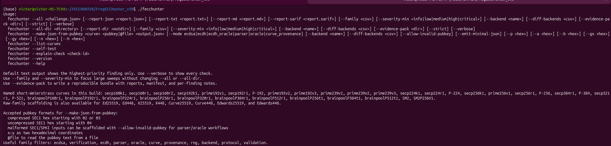

# FrogECCHunter

<p align="center">
  
</p>

<p align="center">
  <strong>Structural ECC forensics with recoverability evidence</strong>
</p>

<p align="center">
  
</p>

FrogECCHunter is an offline ECC audit framework for serious security review. It is built for owned material, challenge files, implementation assessment, parser hardening, internal red team rehearsal on synthetic data, and forensic analysis of recoverable weakness classes. It is designed to be useful both when full recovery is possible and when only structural evidence is available.

This project does not depend on network access. It consumes JSON challenge descriptions, generates JSON challenge templates from public keys, performs complete audit sweeps, scans whole directories of cases, emits evidence bundles, and produces reports in human and machine readable formats.

The current release keeps **348 total checks** in the full sweep.

## 1. Why FrogECCHunter exists

ECC failures do not all look the same. Some cases are trivially recoverable. Some are structurally dangerous but need more artifacts before recovery can be demonstrated. Some live in parser behavior, backend disagreement, provenance failures, or protocol mistakes rather than in signatures themselves.

FrogECCHunter was built to handle that reality.

It aims to answer five questions.

1. Is there a directly recoverable weakness?
2. Is there a structural weakness that deserves serious attention even without full key recovery?
3. Is the issue mathematical, parser related, protocol related, RNG related, or backend related?
4. Can the evidence be preserved in a reproducible report?
5. Can the remediation be stated clearly enough for engineers and auditors to act on it?

## 2. Core capabilities

FrogECCHunter currently provides the following capabilities.

1. Full single case audit through `--all`.
2. Directory wide audit through `--all-dir`.
3. JSON challenge template generation from public keys through `--make-json-from-pubkey`.
4. Report generation in TXT, JSON, Markdown, and SARIF.
5. Evidence bundle generation through `--evidence-pack`.
6. Focused filtering by family and severity.
7. Internal self validation through `--self-test`.
8. Per check documentation through `--explain-check`.
9. Input normalization and capability reporting inside the output.
10. Honest passive analysis paths for families that are not part of the active algebra engine.

## 3. What the engine does today

The active algebra engine in this release is centered on the short Weierstrass path. This includes named curves such as `secp256k1`, `prime256v1`, `secp384r1`, `secp521r1`, and the supported Brainpool paths exposed by the registry.

Raw family templates such as `Ed25519`, `Ed448`, `X25519`, `X448`, `Curve25519`, `Curve448`, `Edwards25519`, and `Edwards448` are supported for JSON scaffolding, parser workflows, oracle workflows, provenance workflows, and passive reporting. They are not presented as full active algebra paths in this release.

That distinction is visible in the reports.

1. `analysis_path = active_algebra` means the public key was parsed and the active algebra checks ran.
2. `analysis_path = passive_parse_preserved` means the public key was preserved for parser, oracle, and provenance analysis even though algebraic parsing failed.
3. `analysis_path = passive_family` means the curve family is currently handled as a passive family in the active algebra engine.

## 4. What the reports mean

Every run is designed to be honest.

When recovery is demonstrated, the report says so.

When recovery is not demonstrated, the report explains why. Typical reasons include the following.

1. No signatures were supplied, so nonce and signature recovery engines remained inactive.
2. The current artifacts did not demonstrate a recoverable weakness.
3. The public key did not parse algebraically, so only passive parser, oracle, or provenance checks could run.
4. The family is currently in passive analysis mode.

This is intentional. The framework is meant to be credible in front of serious reviewers. It should never pretend that a structural finding automatically implies key recovery when the evidence does not support that claim.

## 5. Quick start

### 5.1 Build on Ubuntu

Install dependencies.

```bash
sudo apt update
sudo apt install -y clang lld make libgmp-dev libboost-all-dev libomp-dev
```

Build with the default portable profile.

```bash
make
```

If you prefer an explicit compiler line, this also works.

```bash
clang++ -std=c++23 -DNDEBUG -O2 -pipe -fopenmp=libgomp src/*.cpp -o fecchunter -lgmpxx -lgmp -lgomp -fuse-ld=lld
```

### 5.2 Check that the binary is healthy

```bash
./fecchunter --version
./fecchunter --self-test
```

The self test writes its output into `AUDITTEST` by default and produces a manifest you can inspect immediately.

## 6. Build profiles

The repository contains two build profiles.

### 6.1 Default profile

Use this for serious day to day work, packaging, GitHub releases, and reproducible usage.

```bash
make
```

This profile favors portability and stability.

### 6.2 Ultra profile

Use this only if you explicitly want the aggressive profile contained in `Makefile.ultra`.

```bash
make -f Makefile.ultra
```

For release work, the default profile is the recommended one.

## 7. Command reference

### 7.1 `--version`

Prints the active capability profile.

```bash
./fecchunter --version
```

Typical output includes the active algebra family, raw family mode, report formats, schema version, and feature list.

### 7.2 `--list-curves`

Prints the named curves known to the registry.

```bash
./fecchunter --list-curves
```

Use this whenever you want the exact accepted names from the current build.

### 7.3 `--self-test`

Runs the internal validation suite and writes all artifacts into `AUDITTEST` unless another path is supplied.

```bash
./fecchunter --self-test
./fecchunter --self-test AUDITTEST_CUSTOM
```

What it covers in the current release.

1. Recovery cases.
2. Parser and backend structural cases.
3. Oracle and ECDH cases.
4. Invalid preserved public key cases.
5. Passive raw family cases.
6. Public key to JSON conversion checks.

### 7.4 `--explain-check <id>`

Explains what a check does and why it exists.

```bash
./fecchunter --explain-check tiny_public_key_multiple_scan
```

This is useful when you want to understand a specific finding without reading source code.

### 7.5 `--all <challenge.json>`

Runs the full audit sweep on one JSON challenge file.

```bash
./fecchunter --all samples/related_nonce_delta1.json
./fecchunter --all samples/backend_differential_findings.json
./fecchunter --all samples/valid_pubkey_secp256k1_clean.json
./fecchunter --all samples/valid_pubkey_secp256k1_1337.json
```

By default the terminal output shows the highest priority finding only.

Add `--verbose` if you want the complete stream.

```bash
./fecchunter --all samples/backend_differential_findings.json --verbose
```

### 7.6 `--all-dir <directory>`

Runs the full sweep on every JSON file inside a directory.

```bash
./fecchunter --all-dir samples --report-dir build/reports
```

This is the easiest way to build a batch summary for a corpus.

### 7.7 `--make-json-from-pubkey`

Generates a challenge template from a public key.

```bash
./fecchunter --make-json-from-pubkey <curve> <pubkey|@file> <output.json> [options]
```

Supported modes are:

1. `ecdsa`
2. `ecdh`
3. `ecdh_oracle`
4. `parser`
5. `oracle`
6. `curve_provenance`

Examples follow below.

Generate from a compressed SEC1 key.

```bash
./fecchunter --make-json-from-pubkey secp256k1 036F10E3BCECC3A08DAD5F7602B6F570B45FB451DE2B0965D3E6A8869A8A3E3229 build/from_hex.json --mode parser
```

Generate from a PEM file and let the tool resolve the curve from SPKI.

```bash
./fecchunter --make-json-from-pubkey auto @pubkey.pem build/from_pem.json --mode parser
```

Generate a custom short Weierstrass template.

```bash
./fecchunter --make-json-from-pubkey custom \
  0272588CF4BC7FB52A68D5C81B83643A96A881ACFD9359D268BF675C0173B46920 \
  build/custom.json --mode parser \
  --p FFFFFFFFFFFFFFFFFFFFFFFFFFFFFFFFFFFFFFFFFFFFFFFFFFFFFFFEFFFFFC2F \
  --a 0 \
  --b 7 \
  --gx 79BE667EF9DCBBAC55A06295CE870B07029BFCDB2DCE28D959F2815B16F81798 \
  --gy 483ADA7726A3C4655DA4FBFC0E1108A8FD17B448A68554199C47D08FFB10D4B8 \
  --n FFFFFFFFFFFFFFFFFFFFFFFFFFFFFFFEBAAEDCE6AF48A03BBFD25E8CD0364141 \
  --h 1
```

Generate a parser scaffold from malformed SEC1 or SPKI bytes without forcing point validation.

```bash
./fecchunter --make-json-from-pubkey auto @bad_pubkey.pem build/bad_pubkey.json --mode parser --allow-invalid-pubkey
```

Generate a minimal JSON template.

```bash
./fecchunter --make-json-from-pubkey auto @pubkey.pem build/minimal.json --mode parser --emit-minimal-json
```

### 7.8 Report options

You can request specific reports directly.

```bash
./fecchunter --all samples/related_nonce_delta1.json \
  --report-json build/report.json \
  --report-txt build/report.txt \
  --report-md build/report.md \
  --report-sarif build/report.sarif
```

### 7.9 `--evidence-pack <dir>`

Writes a reproducible bundle that captures the run context and the relevant outputs.

```bash
./fecchunter --all samples/backend_differential_findings.json --evidence-pack build/evidence_backend
```

### 7.10 `--family <csv>`

Restricts output to one or more families.

```bash
./fecchunter --all samples/backend_differential_findings.json --family backend,parser
```

Useful families include the following.

1. `ecdsa`
2. `verification`
3. `ecdh`
4. `parser`
5. `oracle`
6. `curve`
7. `provenance`
8. `rng`
9. `backend`
10. `protocol`
11. `validation`

### 7.11 `--severity-min <level>`

Filters terminal output by severity.

```bash
./fecchunter --all samples/backend_differential_findings.json --severity-min high
```

Valid levels are:

1. `info`
2. `low`
3. `medium`
4. `high`
5. `critical`

### 7.12 `--backend <name>` and `--diff-backends <csv>`

These options label the runtime context for backend sensitive workflows and generated templates.

```bash
./fecchunter --all samples/backend_differential_findings.json --backend openssl
./fecchunter --make-json-from-pubkey secp256k1 036F10E3BCECC3A08DAD5F7602B6F570B45FB451DE2B0965D3E6A8869A8A3E3229 build/from_hex.json --mode parser --backend openssl --diff-backends openssl,libsecp256k1
```

### 7.13 `--strict`

Enables stricter input validation behavior.

```bash
./fecchunter --all samples/backend_differential_findings.json --strict
```

Use this when you want the program to be less forgiving about inconsistent input.

### 7.14 `--verbose`

Shows every check line instead of only the highest priority finding.

```bash
./fecchunter --all samples/related_nonce_delta1.json --verbose
```

## 8. Accepted public key formats

`--make-json-from-pubkey` accepts the following public key forms.

1. Compressed SEC1 hex beginning with `02` or `03`.
2. Uncompressed SEC1 hex beginning with `04`.
3. `x:y` as two hexadecimal coordinates.
4. `@file` to read the key text from a file.
5. Malformed SEC1 or SPKI input together with `--allow-invalid-pubkey` for passive parser and oracle scaffolding.

## 9. JSON structure

A full JSON challenge usually contains the following sections.

1. `schema_version`
2. `title`
3. `mode`
4. `curve`
5. `public_key`
6. `constraints`
7. `facts`
8. `oracle`
9. `signatures`

A representative example follows.

```json
{
  "schema_version": "1.0",
  "title": "Small nonce over secp256k1",
  "mode": "ecdsa",
  "curve": {
    "name": "secp256k1",
    "family": "short_weierstrass"
  },
  "public_key": {
    "compressed": "02..."
  },
  "constraints": {
    "nonce_max_bits": 30,
    "privkey_max_bits": 0,
    "related_delta_max": 8,
    "related_a_abs_max": 0,
    "related_b_abs_max": 0,
    "unix_time_min": 0,
    "unix_time_max": 0
  },
  "facts": {
    "rng.source": "counter",
    "nonce.rfc6979": "false",
    "validation.subgroup_check": "false",
    "backend.diff.pubkey_validation": "true"
  },
  "oracle": {
    "kind": "x_coordinate"
  },
  "signatures": [
    {
      "message": "optional text",
      "hash_hex": "SHA256 digest as hex",
      "r": "hex",
      "s": "hex"
    }
  ]
}
```

### 9.1 Facts

Facts are flattened key value hints. They allow the suite to classify structural risk even when a full exploit cannot be derived from the supplied artifacts alone.

Examples include the following.

1. `validation.subgroup_check`
2. `verification.skips_public_key_validation`
3. `backend.diff.explicit_curve_parameters`
4. `nonce.rfc6979`
5. `rng.source`
6. `oracle.kind`

### 9.2 Constraints

Constraints guide bounded recovery engines and diagnostic scans.

Common fields include the following.

1. `nonce_max_bits`
2. `privkey_max_bits`
3. `related_delta_max`
4. `related_a_abs_max`
5. `related_b_abs_max`
6. `unix_time_min`
7. `unix_time_max`

### 9.3 Public key fields

Typical public key fields include the following.

1. `compressed`
2. `x`
3. `y`
4. `raw_hex` for passive raw family templates
5. source metadata such as `source_kind` when generated from an external public key

## 10. Output model

Every run reports several pieces of context.

### 10.1 Source and normalization

The output now distinguishes these two concepts clearly.

1. `input_source_kind` tells you where the key came from, for example `pem:PUBLIC KEY`, `text`, or `json_embedded`.
2. `input_normalization.kind` tells you what canonical internal form the engine used, for example `sec1_compressed` or `raw_hex`.

### 10.2 Capability matrix

The output explains whether the run used active algebra or a passive path.

Typical fields include the following.

1. `active_algebra`
2. `public_key_parsed`
3. `path`

### 10.3 Why no recovery

When no recovery is demonstrated, the output states why.

This matters for serious review because it prevents overclaiming.

## 11. Sample corpus

The repository includes a broad set of samples. A few representative categories are listed below.

### 11.1 Recovery oriented samples

1. `samples/nonce_reuse_exact.json`
2. `samples/related_nonce_delta1.json`
3. `samples/small_nonce_30bit.json`
4. `samples/small_private_key_20bit.json`
5. `samples/valid_pubkey_secp256k1_1337.json`

### 11.2 Structural and parser oriented samples

1. `samples/backend_differential_findings.json`
2. `samples/parser_and_binding_smells.json`
3. `samples/prng_and_parser_smells.json`
4. `samples/v22_spki_backend_suite.json`
5. `samples/invalid_pubkey_template_playground.json`

### 11.3 Raw family passive samples

1. `samples/raw_family_ed25519_playground.json`
2. `samples/raw_family_x448_playground.json`

### 11.4 Clean playground samples

1. `samples/valid_pubkey_secp256k1_clean.json`
2. `samples/valid_pubkey_secp256r1_clean.json`

## 12. Practical workflows

### 12.1 Audit a single file and keep all reports

```bash
./fecchunter --all samples/related_nonce_delta1.json \
  --report-json build/related.json \
  --report-txt build/related.txt \
  --report-md build/related.md \
  --report-sarif build/related.sarif \
  --evidence-pack build/related_evidence
```

### 12.2 Sweep the full sample directory

```bash
./fecchunter --all-dir samples --report-dir build/reports --evidence-pack build/evidence_batch
```

### 12.3 Generate a clean parser template from PEM and run it immediately

```bash
cat > pubkey.pem <<'PEM'
-----BEGIN PUBLIC KEY-----
MFYwEAYHKoZIzj0CAQYFK4EEAAoDQgAEbxDjvOzDoI2tX3YCtvVwtF+0Ud4rCWXT
5qiGmoo+MimrdZXXTaX9vk4QYeieszVn2i70qVcT+U6QF85weg/UWQ==
-----END PUBLIC KEY-----
PEM

./fecchunter --make-json-from-pubkey auto @pubkey.pem build/pubkey.json --mode parser
./fecchunter --all build/pubkey.json
```

### 12.4 Preserve an invalid key for passive analysis

```bash
cat > bad_pubkey.pem <<'PEM'
-----BEGIN PUBLIC KEY-----
MDYwEAYHKoZIzj0CAQYFK4EEAAoDIgACAAAAAAAAAAAAAAAAAAAAAAAAAAAAAAAA
AAAAAAAAAAU=
-----END PUBLIC KEY-----
PEM

./fecchunter --make-json-from-pubkey auto @bad_pubkey.pem build/bad_pubkey.json --mode parser --allow-invalid-pubkey
./fecchunter --all build/bad_pubkey.json
```

## 13. What the framework offers in practice

This project is useful in four main ways.

1. It can prove recoverability in bounded laboratory scenarios.
2. It can classify structural weakness even when full recovery is not demonstrated.
3. It can preserve parser and oracle evidence without crashing the main workflow.
4. It can package evidence in formats that are usable in engineering and audit pipelines.

## 14. Current boundaries

This release is deliberately honest about its boundaries.

1. Active algebra is centered on the short Weierstrass path.
2. Raw family templates remain passive analysis paths in this release.
3. Backend differential findings are evidence driven rather than runtime library loading inside the tool.
4. A clean report does not prove an implementation is secure. It only means the supplied artifacts did not trigger confirmed findings under the configured checks.

## 15. Repository layout

A typical checkout looks like this.

1. `src/` contains the engine and CLI.
2. `samples/` contains the audit corpus.
3. `examples/` contains starter JSON templates.
4. `assets/` contains the logo and screenshot.
5. `scripts/` contains release check helpers.
6. `Makefile` contains the default portable build.
7. `Makefile.ultra` contains the aggressive build profile.

## 16. Troubleshooting

### 16.1 No findings on a clean key

That is normal. A valid public key with no signatures and no structural facts should often produce no confirmed findings.

### 16.2 No recovery demonstrated

Look at `why_no_recovery`. The tool explains whether signatures were missing, whether the family is passive, or whether the current artifacts simply did not support recovery.

### 16.3 Invalid key parsing

If you need to preserve malformed bytes for parser or oracle work, generate the template with `--allow-invalid-pubkey`.

### 16.4 Family support questions

Run `./fecchunter --version` and `./fecchunter --list-curves`. The output tells you what is active and what is passive in the current build.

## 17. Release status

This repository is intended to be usable immediately. The framework already supports serious single case auditing, batch processing, evidence generation, and self validation.

If you want a short confidence loop before doing anything else, use these commands.

```bash
./fecchunter --version
./fecchunter --self-test
./fecchunter --all samples/valid_pubkey_secp256k1_1337.json
./fecchunter --all samples/backend_differential_findings.json
```

## 18. License

MIT

## 19. Final note

FrogECCHunter is strongest when it is treated as a disciplined forensic tool rather than as a black box. Feed it honest artifacts. Read the reports carefully. Distinguish recoverability from structural risk. Preserve evidence. Keep the workflows reproducible.

That is the entire point of this project.
